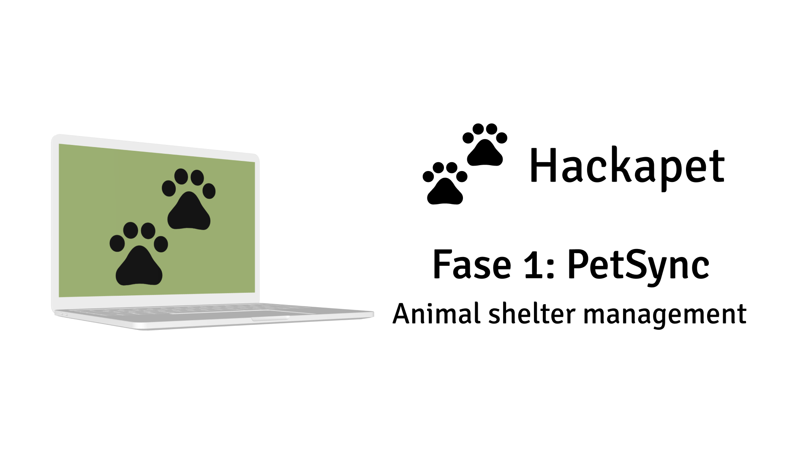

# PetSync Frontend
[English](README.md) | [Español](README.es.md)



Frontend para el proyecto PetSync, construido con React y TypeScript.

## Índice
1. [Propósito del Proyecto](#propósito-del-proyecto)
2. [Tecnologías](#tecnologías)
3. [Configuración del Entorno](#configuración-del-entorno)
   - [Node.js y npm](#nodejs-y-npm)
   - [Git](#git)
   - [Cuenta de GitHub](#cuenta-de-github)
   - [Editor de Código](#editor-de-código)
4. [Instrucciones de Instalación](#instrucciones-de-instalación)
   - [Instalar Node.js y npm](#instalar-nodejs-y-npm)
   - [Instalar Git](#instalar-git)
   - [Clonar el Repositorio](#clonar-el-repositorio)
   - [Instalar Dependencias](#instalar-dependencias)
5. [Ejecutar la Aplicación](#ejecutar-la-aplicación)
6. [Pruebas](#pruebas)
7. [Compilación para Producción](#compilación-para-producción)
8. [Recursos Adicionales](#recursos-adicionales)

## Propósito del Proyecto
PetSync Frontend es la interfaz de usuario para el proyecto PetSync, una aplicación diseñada para optimizar la gestión de refugios de animales. Proporciona una interfaz intuitiva y receptiva para que el personal del refugio gestione animales, inventario y genere informes.

Características principales:
- Panel de control para una visión rápida del estado del refugio
- Interfaz de gestión de animales
- Sistema de seguimiento de inventario
- Herramientas de informes y análisis

## Tecnologías
- React
- TypeScript
- Redux para la gestión del estado
- React Router para la navegación
- Styled Components para el estilizado
- Jest y React Testing Library para pruebas

## Configuración del Entorno
### Node.js y npm
Se requiere Node.js para ejecutar el proyecto, y npm (Node Package Manager) se usa para gestionar las dependencias.

### Git
Git se utiliza para el control de versiones.

### Cuenta de GitHub
Se necesita una cuenta de GitHub para acceder al repositorio y colaborar en el proyecto.

### Editor de Código
Recomendamos usar Visual Studio Code, pero cualquier editor de código moderno con soporte para TypeScript funcionará.

## Instrucciones de Instalación

### Instalar Node.js y npm
1. Visita el [sitio web oficial de Node.js](https://nodejs.org/).
2. Descarga e instala la versión LTS para tu sistema operativo.
3. Verifica la instalación abriendo una terminal y ejecutando:
   ```
   node --version
   npm --version
   ```

### Instalar Git
#### En Windows:
1. Descarga Git desde [git-scm.com](https://git-scm.com/download/win).
2. Ejecuta el instalador y sigue el asistente de configuración.

#### En macOS:
1. Instala Homebrew si aún no lo tienes:
   ```
   /bin/bash -c "$(curl -fsSL https://raw.githubusercontent.com/Homebrew/install/HEAD/install.sh)"
   ```
2. Instala Git usando Homebrew:
   ```
   brew install git
   ```

#### En Linux:
Usa el gestor de paquetes de tu distribución. Para Ubuntu o Debian:
```
sudo apt-get update
sudo apt-get install git
```

### Clonar el Repositorio
1. Abre una terminal.
2. Navega al directorio donde quieres almacenar el proyecto.
3. Clona el repositorio:
   ```
   git clone https://github.com/hackapet-project/petsync-frontend.git
   ```
4. Navega al directorio del proyecto:
   ```
   cd petsync-frontend
   ```

### Instalar Dependencias
En el directorio del proyecto, ejecuta:
```
npm install
```

## Ejecutar la Aplicación
Para iniciar el servidor de desarrollo:
```
npm start
```
La aplicación estará disponible en `http://localhost:3000`.

## Pruebas
Para ejecutar la suite de pruebas:
```
npm test
```

## Compilación para Producción
Para crear una compilación de producción:
```
npm run build
```

## Recursos Adicionales
- [Documentación de React](https://es.reactjs.org/docs/getting-started.html)
- [Documentación de TypeScript](https://www.typescriptlang.org/docs/)
- [Documentación de Redux](https://es.redux.js.org/introduccion/primeros-pasos)
- [Wiki del Proyecto](https://github.com/hackapet-project/petsync-frontend/wiki)

Para más información o si encuentras algún problema, consulta nuestra [wiki](https://github.com/hackapet-project/petsync-frontend/wiki) o abre un issue en el repositorio.
